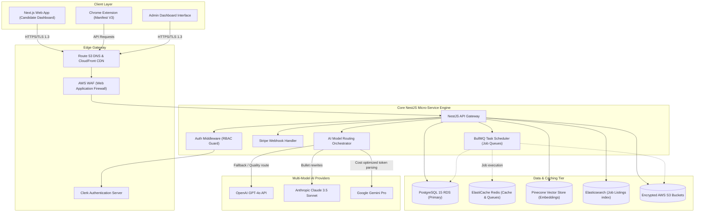

# System Architecture Specifications — JobIN

This document defines the end-to-end technical system architecture for the **JobIN** SaaS platform, detailing component configurations, database structures, security containment, and third-party integrations.

---

## 1. High-Level Architecture Diagram

The JobIN platform is built upon a micro-SaaS multi-tenant model. The diagram below illustrates the interactions between candidates, administrators, the main Web application, the Manifest V3 Chrome Extension, and the core NestJS API backend.



---

## 2. Component Layout & Tech Stack

### 2.1 Client Layer
*   **Web Application:** Next.js 14+ utilizing the App Router. Fully static pages built using React Server Components (RSC) to reduce load latency, client-side rendering with TailwindCSS and ShadCN UI for the dashboard, and Framer Motion for animations.
*   **Chrome Extension (Manifest V3):** Renders inside a sidebar (`chrome.sidePanel`) to support real-time user workspace views. A Background Service Worker manages token storage and communicates via `chrome.runtime` message parsing to standard Content Scripts injected into job boards.
*   **Admin Dashboard:** Embedded Next.js Admin interface with custom path protections. Standardized components for viewing analytics and executing user modifications.

### 2.2 API Server Layer
*   **NestJS Framework:** Scalable TypeScript Node.js framework. Divided into clear modules: `AuthModule`, `UserModule`, `ResumeModule`, `JobTrackerModule`, `AIOrchestrationModule`, `AdminModule`, and `StripeModule`.
*   **Authentication Guards:** Custom NestJS guards checking JWT tokens provided by Clerk (or Auth0 for Enterprise SAML logins). Enforces roles: `Candidate`, `Recruiter`, `Admin_Finance`, `Admin_Support`, and `SuperAdmin`.
*   **BullMQ Execution Queues:** Offloads long-running asynchronous processes (PDF resume parsing, batch job crawling, automated cold emails) into Redis-backed workers.

### 2.3 Storage and Search Tier
*   **PostgreSQL 15 (AWS RDS):** Relational DB storing transactional details (user accounts, applications, audit logs). Optimized using index maps and partitioned by date where appropriate (e.g., activity logs).
*   **Prisma ORM:** Standardized object-relational mapping, database migrations, and type-safe query parameters.
*   **Pinecone Vector Database:** Stores 1536-dimensional vector embeddings of parsed candidate resumes and aggregated job descriptions (using OpenAI `text-embedding-3-small`). Enables semantic cosine similarity matching.
*   **Elasticsearch 8+:** Houses aggregated job search data, optimizing high-throughput text filtering (location, salary, keyword ranges).
*   **ElastiCache Redis:** Handles API rate limiting, application session cache stores, and BullMQ task configurations.
*   **AWS S3 + CloudFront:** Encrypted repository for candidate documents (PDF/DOCX).

---

## 3. Multi-Tenant Database Isolation Strategy

To ensure multi-tenant security and clear boundaries between users and enterprise organizations, JobIN employs **Logical Isolation with Tenant Schema Contexts**:

1.  **Row-Level Partitioning:** Every record in standard tables (e.g., `job_applications`, `resumes`) contains a `tenant_id` string mapped to either a Candidate ID or an Organization ID.
2.  **NestJS Tenant Interceptor:** A global middleware parses the authenticated token and extracts the `tenant_id`. It injects this filter automatically into all Prisma queries to prevent cross-tenant leakage:
    ```typescript
    prisma.jobApplication.findMany({
      where: {
        tenantId: currentTenantId,
        id: applicationId,
      }
    });
    ```
3.  **SSO Subdomain Routing:** Enterprise customers use custom subdomains (e.g., `companyname.jobin.ai`). The Next.js middleware detects this header and forwards authentication requests exclusively to the corresponding SSO provider (Okta/Azure AD) configured for that tenant.

---

## 4. Multi-Model AI Routing Flow

To optimize cost, speed, and execution quality, JobIN uses a dynamic AI router middleware:

*   **Priority 1 (High Complexity):** Resume bullet rewrites and cover letter generation route to **Claude 3.5 Sonnet** for superior linguistic output.
*   **Priority 2 (Standard Flow):** Chat interactions and interview simulations route to **GPT-4o**.
*   **Priority 3 (Token-Heavy Parsing / Estimation):** Raw keyword scanning, match score breakdown calculations, and skill gap mapping route to **Gemini Pro** for cost efficiency.
*   **Fallback Logic:** If any primary provider throws a `503 Service Unavailable`, a rate-limit error `429`, or exceeds a `5,000ms` execution deadline, the router automatically falls back to the secondary models in order of priority.

---

## 5. Monitoring & Operational Reliability

*   **Sentry:** Injected into both the frontend Next.js App Router and the backend NestJS Exception Filters to trace client-side UI anomalies and server-side database crashes.
*   **Prometheus & Grafana:** Monitors infrastructure load (EKS node memory, PostgreSQL connection pools, Redis queue backlogs).
*   **Datadog APM:** Traces end-to-end user request latency, measuring database query speed and AI API round-trip times.
