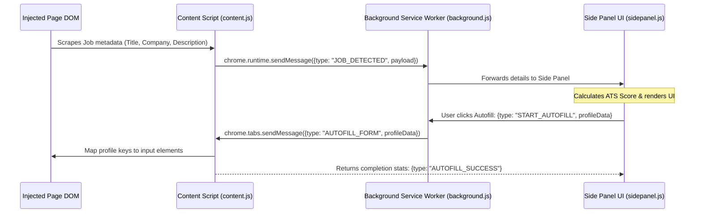

# Chrome Extension Architecture — JobIN Copilot

This document specifies the structural architecture, DOM parsing engine, and security boundaries for the **JobIN Copilot** Manifest V3 Chrome Extension.

---

## 1. Manifest V3 Configuration

The extension configuration guarantees access to DOM scraping utilities, side panel routing, and session state synchronization.

```json
{
  "manifest_version": 3,
  "name": "JobIN Copilot",
  "version": "1.0.0",
  "description": "Autofill job applications, tailor resumes in 10 seconds, and track matches automatically.",
  "permissions": [
    "activeTab",
    "storage",
    "sidePanel",
    "scripting",
    "declarativeNetRequest"
  ],
  "host_permissions": [
    "https://*.linkedin.com/*",
    "https://*.indeed.com/*",
    "https://*.glassdoor.com/*",
    "https://*.reed.co.uk/*",
    "https://*.totaljobs.com/*",
    "https://*.cv-library.co.uk/*",
    "https://*.monster.co.uk/*",
    "https://*.greenhouse.io/*",
    "https://*.lever.co/*",
    "https://*.workday.com/*",
    "https://api.jobin.ai/*"
  ],
  "background": {
    "service_worker": "background.js",
    "type": "module"
  },
  "content_scripts": [
    {
      "matches": [
        "https://*.linkedin.com/*",
        "https://*.indeed.com/*",
        "https://*.reed.co.uk/*",
        "https://*.greenhouse.io/*",
        "https://*.lever.co/*"
      ],
      "js": ["content.js"],
      "run_at": "document_end"
    }
  ],
  "side_panel": {
    "default_path": "sidepanel.html"
  },
  "action": {
    "default_title": "Open JobIN Sidebar"
  },
  "options_page": "options.html"
}
```

---

## 2. Process Architecture & Message Routing

The system coordinates page interaction using three isolated scripts communicating via JSON message buffers:



---

## 3. DOM Parser & Job Description Scraper

The content script executes custom DOM query maps matching the host page patterns:

*   **LinkedIn Parser:**
    *   Job Title Selector: `h1.job-details-jobs-unified-top-card__job-title`
    *   Company Selector: `.job-details-jobs-unified-top-card__company-name a`
    *   Job Description Selector: `#job-details`
*   **Greenhouse Parser:**
    *   Job Title Selector: `h1.app-title`
    *   Company Selector: `span.company-name`
    *   Job Description Selector: `#content`

---

## 4. Autofill Execution & ATS Mapping Engine

The autofill engine uses a two-phased mapping mechanism: **Hardcoded CSS Selectors** (fallback) and **Heuristic Name Match Scans** (primary).

### 4.1 Heuristic Label Scanner
If an input element doesn't match predefined ATS selectors, the engine scrapes nearby label elements or placeholder text:
```javascript
function findInputByLabel(labelTextPattern) {
  const labels = Array.from(document.querySelectorAll("label"));
  const targetLabel = labels.find(label => 
    labelTextPattern.test(label.textContent.toLowerCase())
  );
  if (targetLabel) {
    const inputId = targetLabel.getAttribute("for");
    if (inputId) return document.getElementById(inputId);
    return targetLabel.querySelector("input, select, textarea");
  }
  return null;
}
```

### 4.2 ATS Element Selectors Matrix

| Platform | First Name Field | Resume File Input | Salary Expectation | Work Authorization |
| :--- | :--- | :--- | :--- | :--- |
| **Greenhouse** | `input[name="first_name"]` | `input[type="file"][name*="resume"]` | `input[name*="salary"]` | `select[name*="visa"], select[name*="sponsor"]` |
| **Lever** | `input[name="name"]` | `input[type="file"]` | `input[name*="salary"]` | `input[name*="visa"], input[name*="sponsor"]` |
| **Workday** | `input[data-automation-id="legalNameSection_firstName"]` | `input[type="file"][data-automation-id*="file-upload"]` | `input[data-automation-id*="salary"]` | `select[data-automation-id*="visa"]` |

---

## 5. Security & Isolation Constraints

1.  **PII Isolation:** The extension does not cache resume binary contents locally. Stored access tokens and user configurations are held in `chrome.storage.local` encrypted using a user-session key generated by Clerk.
2.  **Cross-Origin Isolation:** Cross-origin API routing requests are restricted exclusively to `https://api.jobin.ai` using a secure token payload header. Direct external API scripting is blocked via Content Security Policies (CSP) defined in the background service worker context.
