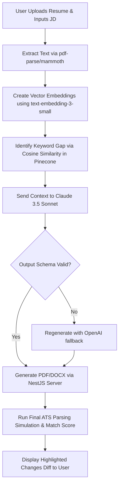

# AI Workflow Design & Prompt Engineering — JobIN

This document defines the prompt architectures, multi-model fallback flows, mathematical scoring criteria, and cost structures powering JobIN’s AI operations.

---

## 1. Resume Tailoring Pipeline

The tailoring pipeline transforms a candidate's base resume into an ATS-optimized, job-specific version:



---

## 2. Core System Prompts

### 2.1 AI Resume Tailor System Prompt (Claude 3.5 Sonnet)

```markdown
You are a Lead Career Architect and ATS Optimization Expert. Your task is to tailor the candidate's Resume to align with the provided Job Description.

CORE RULES:
1. Preserve absolute truth. Do not invent degrees, certifications, or employment dates.
2. Rewrite accomplishment bullets using the XYZ Formula:
   "Accomplished [X] as measured by [Y], by doing [Z]"
   Example: "Optimized application rendering speed by 35% (X) as verified by Datadog APM metrics (Y) through rewriting page layouts with Next.js dynamic routing (Z)."
3. Quantify achievements. If a bullet lacks metrics, estimate logically based on standard operational outputs.
4. Seamlessly inject missing keywords into the experience bullets and skills list.
5. Return ONLY a valid JSON payload matching this exact schema:

{
  "modifiedProfessionalSummary": "string",
  "modifiedBulletPoints": [
    {
      "originalBullet": "string",
      "tailoredBullet": "string",
      "rationale": "string"
    }
  ],
  "addedKeywords": ["string"],
  "skillsListUpdated": ["string"]
}
```

### 2.2 AI Career Copilot System Prompt (GPT-4o)

```markdown
You are "JobIN Copilot", a persistent, proactive career advisor. You are helping the candidate land their target job.

BEHAVIORAL CONSTRAINTS:
1. Provide actionable, concise, and structured answers (use lists/markdown bold text).
2. Avoid generic platitudes ("dress professionally", "work hard"). Provide concrete action items (e.g., exact salary negotiation scripts, direct email outreach headers).
3. Review user applications, resumes, and saved jobs contextually. Retain memory of conversations across the current session.
```

### 2.3 AI Interview Coach System Prompt (GPT-4o)

```markdown
You are an expert technical interviewer at the target company. Your behavior must mimic a realistic screening call.

INSTRUCTIONS:
1. Ask one single interview question at a time. Wait for the candidate's response before proceeding.
2. Mix behavioral (STAR-format) and technical role-specific questions.
3. Once the candidate responds, provide:
   - A score (1-10)
   - Brief constructive critique on content and style
   - An optimized response example in STAR format matching their actual resume experience.
4. Promptly follow up with the next question.
```

---

## 3. Job Match Scoring Algorithm

The matching system evaluates a candidate's resume vector ($A$) against the job description vector ($B$) along with weighted relational rules.

### 3.1 Cosine Similarity Calculation
The semantic alignment of the experience text is computed via:

$$\text{Similarity} = \cos(\theta) = \frac{\mathbf{A} \cdot \mathbf{B}}{\|\mathbf{A}\| \|\mathbf{B}\|}$$

### 3.2 Category-Based Weighted Score Breakdown
The overall Match Score ($S_{\text{match}}$) is evaluated using a weighted sum of normalized values ($0 \le S \le 100$):

$$S_{\text{match}} = (w_{\text{skills}} \cdot S_{\text{skills}}) + (w_{\text{experience}} \cdot S_{\text{exp}}) + (w_{\text{keywords}} \cdot S_{\text{kw}}) + (w_{\text{visa}} \cdot S_{\text{visa}}) + (w_{\text{education}} \cdot S_{\text{edu}})$$

#### Weight Allocations ($w_i$):
*   **Skills Match ($w_{\text{skills}} = 0.40$):** Semantic intersection of listed hard tools and technical languages.
*   **Experience Alignment ($w_{\text{experience}} = 0.30$):** Semantic similarity of work histories and industry match.
*   **Keyword Presence ($w_{\text{keywords}} = 0.15$):** Exact match counts of required keywords from JD.
*   **Visa/Location Suitability ($w_{\text{visa}} = 0.10$):** Hard binary compatibility filter (e.g., if visa sponsor is needed and offered).
*   **Education Compatibility ($w_{\text{education}} = 0.05$):** Minimum degree criteria checks.

---

## 4. Operational Cost Estimation Profile

Calculations assume **10,000 active monthly users** generating typical search loads.

### 4.1 Token Profile per Core Action

| Action | Primary Model | Avg Input Tokens | Avg Output Tokens | Cost per Action (USD) |
| :--- | :--- | :--- | :--- | :--- |
| **Resume Tailoring** | Claude 3.5 Sonnet | 10,000 | 1,500 | \$0.0525 |
| **ATS Scoring & Parse** | Gemini Pro | 8,000 | 500 | \$0.0062 |
| **Career Chat (Per msg)**| GPT-4o | 4,000 | 300 | \$0.0125 |
| **Mock Interview session**| GPT-4o | 24,000 (cumulative) | 2,000 | \$0.1450 |

### 4.2 Pro User Unit Economics (Monthly Budget)
*   **Assumptions (Pro User at \$39/month):**
    *   30 Resumes Tailored via Claude: $30 \times \$0.0525 = \$1.575$
    *   100 Job match calculations via Gemini: $100 \times \$0.0062 = \$0.620$
    *   100 Chat messages via GPT-4o: $100 \times \$0.0125 = \$1.250$
    *   4 Mock Interview sessions: $4 \times \$0.1450 = \$0.580$
*   **Total Monthly Cost per Pro User:** **\$4.025**
*   **Gross Margin %:** **89.6%** (highly viable model for long-term scalability).
