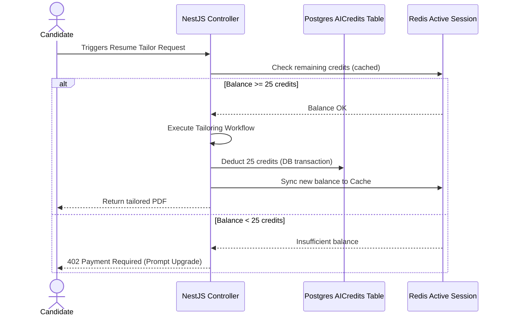

# Monetization & Billing Strategy — JobIN

This document defines the pricing matrices, feature flags, AI credit schedules, and technical Stripe configurations for JobIN.

---

## 1. Stripe Product & Subscription Metadata

To decouple database queries from Stripe endpoints, plan metadata is mapped directly onto the Stripe product object properties.

```json
{
  "product_id": "prod_premium_001",
  "metadata": {
    "plan_key": "PREMIUM",
    "credit_limit": "200",
    "resume_versions_limit": "5",
    "extension_autofill_enabled": "true",
    "mock_interviews_enabled": "false",
    "unlimited_copilot_chat": "false"
  }
}
```

### 1.1 Subscription Plan Pricing Tiers

| Tier | Monthly Price (USD) | Monthly Price (GBP) | Annual Discount | Key Limits |
| :--- | :--- | :--- | :--- | :--- |
| **Free** | \$0 | £0 | - | 5 Resumes, 5 Cover Letters, No Autofill |
| **Premium** | \$19 | £15 | 20% (\$182 / £144 yr) | 200 Credits/mo, 100 Autofills/mo, 5 Resumes |
| **Pro** | \$39 | £29 | 20% (\$374 / £278 yr) | 1000 Credits/mo, Unlimited Autofills, Unlimited Resumes |
| **Enterprise** | Custom | Custom | Negotiated | Customized limits, dedicated SSO domain, custom AI models |

---

## 2. AI Credit Cost Allocation Schedule

Operations deduct credits from the user’s cached database balance.



### 2.1 Operational Credit Mappings

| Operational Action | Credit Cost | Execution Model |
| :--- | :--- | :--- |
| **Resume Upload & Analysis** | 5 Credits | Gemini Pro parsing check |
| **Resume Tailoring** | 25 Credits | Claude 3.5 Sonnet rewrite + PDF build |
| **Cover Letter Generation** | 15 Credits | Claude 3.5 Sonnet customized build |
| **AI Copilot Message** | 1 Credit | GPT-4o conversational check |
| **AI Mock Interview Session** | 50 Credits | Multiple round mock interview + grading |
| **Autofill Submission** | 5 Credits | Chrome extension content script injection |

---

## 3. Feature Flags & Access Controls Configuration

Permissions are defined globally inside the database. A JSON payload regulates candidate UI view flags based on their Stripe token metadata:

```json
{
  "FREE": {
    "allow_resumes_tailoring": false,
    "allow_cover_letter_generation": true,
    "allow_autofill": false,
    "allow_insider_referrals": false,
    "allow_interview_coach": false,
    "allow_advanced_analytics": false
  },
  "PREMIUM": {
    "allow_resumes_tailoring": true,
    "allow_cover_letter_generation": true,
    "allow_autofill": true,
    "allow_insider_referrals": true,
    "allow_interview_coach": false,
    "allow_advanced_analytics": false
  },
  "PRO": {
    "allow_resumes_tailoring": true,
    "allow_cover_letter_generation": true,
    "allow_autofill": true,
    "allow_insider_referrals": true,
    "allow_interview_coach": true,
    "allow_advanced_analytics": true
  }
}
```

---

## 4. Secondary Revenue & Growth Loops

1.  **AI Credit Top-ups:** Candidates on any tier can purchase token packages:
    *   **Starter Pack (100 Credits):** \$4.99
    *   **Pro Pack (500 Credits):** \$19.99
2.  **Affiliate Learning Paths integration:** Gaps identified by the Skill Gap Analyzer route candidates to Udemy or Coursera classes. JobIN earns 15% commissions on referrals.
3.  **Recruiter Directory Access:** Future phase recruiters pay \$99/month to search anonymized, verified matching candidates who have opt-in consented to recruitment outreach.
