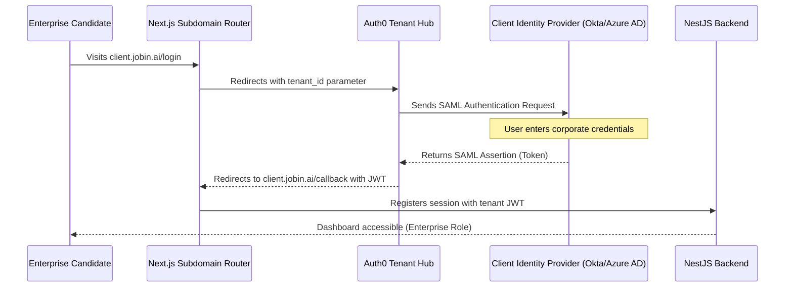

# Enterprise Scope Architecture — JobIN

This document defines the technical design, security rules, and integration workflows for JobIN's Enterprise Tier, enabling support for white-labeling, SSO, and custom AI models.

---

## 1. SAML SSO Authentication Flow (Auth0 / Okta)

Enterprise clients authenticate using their own identity providers (IdPs) via Auth0 connections.



---

## 2. Multi-Tenant AWS Resource Isolation

To meet enterprise compliance requirements, data isolation is enforced across storage, databases, and encryption.

*   **Database Isolation (Row-Level Security):** PostgreSQL implements Row-Level Security (RLS) on the database cluster:
    ```sql
    ALTER TABLE job_applications ENABLE ROW LEVEL SECURITY;
    CREATE POLICY tenant_isolation_policy ON job_applications 
      USING (tenant_id = current_setting('app.current_tenant_id'));
    ```
*   **Encrypted Storage Container Isolation:** Each enterprise client is allocated a dedicated S3 folder path with access controlled by AWS KMS Keys assigned per organization.
    ```
    s3://jobin-enterprise-resumes/tenant_uuid_001/resumes/... [Encrypted via KMS-001]
    s3://jobin-enterprise-resumes/tenant_uuid_002/resumes/... [Encrypted via KMS-002]
    ```

---

## 3. White-Label Subdomain Routing Mechanisms

Custom client portals resolve their branding configurations dynamically based on the requesting host header:

1.  **Wildcard DNS Mapping:** A wildcard DNS record (`*.jobin.ai`) maps incoming subdomains to the AWS CloudFront ingress node.
2.  **Branding Configuration Fetching:** Next.js middleware extracts the hostname (e.g., `acme.jobin.ai`) and requests the corresponding configuration:
    ```typescript
    // GET /v1/settings/branding?domain=acme.jobin.ai
    {
      "tenantId": "e0d0b0c0-1234-5678-90ab-cdef12345678",
      "companyName": "Acme Corp",
      "logoUrl": "https://cdn.jobin.ai/branding/acme/logo.png",
      "primaryColor": "#ff5722",
      "fontFamily": "Inter, sans-serif"
    }
    ```
3.  **Dynamic Theme Injection:** Custom CSS variables are injected into the root HTML node, modifying the UI theme on the fly.

---

## 4. LLM Fine-Tuning Pipeline

Enterprise clients can fine-tune LLMs on their historical application data to optimize candidate matching:

```
[Successful App Data JSON] -> [Validation Clean Script] -> [Format JSONL Training Logs]
                                                                    |
                                                                    v
[OpenAI Fine-Tuning API] <------ [Create Fine-Tuning Job] <---------+
          |
          v
[Register Model ID: ft-gpt-4o-acme-2026] -> [Assign Routing rules for Acme requests]
```

*   **Training Set Generation:** Collects successful resumes and job description templates, converting them to JSONL format:
    `{"messages": [{"role": "system", "content": "..."}, {"role": "user", "content": "resume + jd"}, {"role": "assistant", "content": "output rewrite"}]}`
*   **Model Isolation:** Fine-tuned weights are stored securely within the client's AWS context, preventing other tenants from accessing their proprietary model configurations.

---

## 5. Enterprise Service Level Agreement (SLA)

*   **Uptime Guarantee:** 99.9% monthly uptime, monitored by third-party checks.
*   **Incident Response Times:**
    *   **Priority 1 (Critical Outage):** Less than 1 hour.
    *   **Priority 2 (High Degradation):** Less than 4 hours.
    *   **Priority 3 (Normal Support):** Less than 24 hours.
*   **Account Management:** Designated account manager, quarterly business reviews (QBRs), and custom data-processing agreement (DPA) templates.
